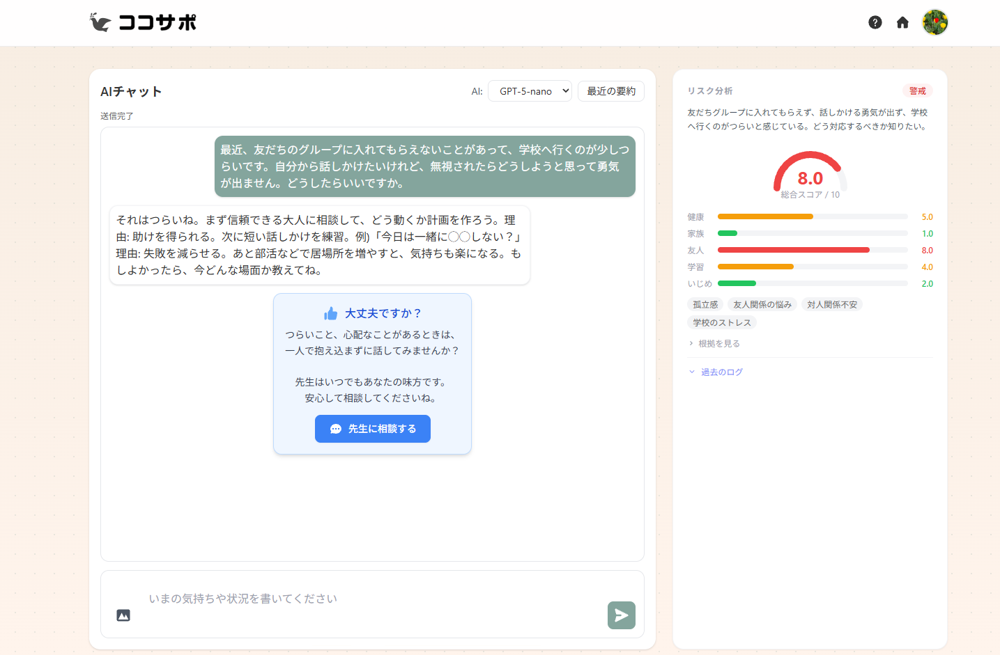

# Student Support AI

生徒のメンタルヘルス支援を目的とした AI チャットアプリです。
OpenAI GPT とローカル LLM（Ollama）の両方に対応し、教員・管理者向けのダッシュボードも備えています。

---

## スクリーンショット

| ホーム | AI チャット |
|--------|------------|
|  |  |

| 教員ダッシュボード | 管理者ページ |
|------------------|------------|
|  |  |

---

## What's New

- [2026-04-25] README を刷新（PR #28）
- [2026-02-21] 教育関係者に本アプリを紹介
- [2025-11-21] ユメカタリ 学生生成AIコンテストの最終選考会に参加 ＆ 開発部門優秀賞を受賞
- [2025-10-15] プロジェクト開始
---

## 主な機能

- **AI チャット** — テキスト・画像に対応したストリーミング応答
- **リスク分析** — 会話から自傷・いじめ・不登校・健康リスクを自動スコアリング
- **会話の自動要約** — 直近10件の会話を要約してメモとして保持
- **教員との1対1相談** — 匿名・通常の両モードに対応
- **教員ダッシュボード** — 高リスク生徒のアラートと会話履歴の検索
- **ニュース・記事推薦** — NHK NEWS WEB EASY / Bing Web Search / Mastodon から自動推薦
- **キッズモード** — 小中学生向けのコンテンツフィルタ
- **認証** — パスワード認証 / Google OAuth
- **管理者機能** — 教師・生徒の一括登録・管理・削除
- **自動ログ削除** — 30日経過したメッセージを自動削除（プライバシー保護）

---

## 技術スタック

| カテゴリ | 技術 |
|---------|------|
| バックエンド | FastAPI, Uvicorn, Python 3.11 |
| テンプレート | Jinja2 |
| AI | OpenAI API (gpt-5-nano), Ollama (qwen3:8b 推奨) |
| データベース | SQLite |
| 認証 | セッション認証 / Google OAuth (Authlib) |
| HTTP クライアント | httpx |
| フィード解析 | feedparser |
| 環境管理 | conda, python-dotenv |

---

## 画面構成

| URL / テンプレート | 役割 |
|--------------------|------|
| `/login` | ログイン・新規登録（パスワード / Google OAuth） |
| `/setup-profile` | 初回プロフィール設定（Google 連携時） |
| `/` (index) | ホーム — 機能メニュー＋おすすめニュース・記事 |
| `/chat` | AI チャット（テキスト＋画像、リスク分析パネル付き） |
| `/chat-teacher` | 教員との1対1相談チャット |
| `/dashboard` | 教員向け — 高リスク生徒アラート・会話履歴 |
| `/messages` | 自分のメッセージログ・検索 |
| `/admin` | 管理者ページ — 教師・生徒管理 |

---

## セットアップ手順

### 1. リポジトリをクローン

```bash
git clone git@github.com:Mugi3233/student-support-ai.git
cd student-support-ai/backend
```

### 2. conda 環境を作成して有効化

```bash
conda env create -f environment.yml -n stu_sup
conda activate stu_sup
pip install -r requirements.txt
```

### 3. `.env` を作成

```bash
cp .env.example .env
# エディタで必須変数を設定（下記の環境変数一覧を参照）
```

### 4. アプリを起動

```bash
uvicorn app.main:app --reload --port 8000
```

### 5. ブラウザでアクセス

```
http://127.0.0.1:8000
```

---

## 環境変数一覧

### 必須

| 変数名 | デフォルト | 説明 |
|--------|-----------|------|
| `OPENAI_API_KEY` | — | OpenAI API キー |
| `SECRET_KEY` | `dev-secret-change-me` | セッション署名用の秘密鍵（**本番環境では必ず変更**） |

### AI モデル設定

| 変数名 | デフォルト | 説明 |
|--------|-----------|------|
| `OPENAI_MODEL` | `gpt-5-nano` | 使用する OpenAI モデル |
| `OLLAMA_MODEL` | `qwen3:8b` | Ollama で使用するモデル名 |
| `OLLAMA_HOST` | `http://localhost:11434` | Ollama サーバーのエンドポイント |

### 任意（推薦機能の拡張）

| 変数名 | デフォルト | 説明 |
|--------|-----------|------|
| `BING_SEARCH_API_KEY` | — | Web 記事推薦用（未設定時はニュース/イベント/豆知識のみ） |
| `BING_SEARCH_ENDPOINT` | `https://api.bing.microsoft.com` | Bing API エンドポイント |
| `MASTODON_BASE_URL` | — | Mastodon インスタンス（例: `https://mastodon.social`） |
| `MASTODON_ACCESS_TOKEN` | — | Mastodon API アクセストークン |

### キッズモード

| 変数名 | デフォルト | 説明 |
|--------|-----------|------|
| `KIDS_MODE` | `0` | `1` に設定するとキッズモードが有効になる |
| `KIDS_NEWS_FEEDS` | NHK NEWS WEB EASY | 子ども向けニュースフィード URL（カンマ区切り） |
| `KIDS_INTEREST_KEYWORDS` | — | 子ども向けの興味キーワード（カンマ区切り） |

---

## API エンドポイント概要

起動後は `http://127.0.0.1:8000/docs` で Swagger UI から全エンドポイントを確認できます。

### 認証
| メソッド | パス | 説明 |
|---------|------|------|
| GET/POST | `/login` | ログイン・新規登録 |
| GET | `/login/google` | Google 認証リダイレクト |
| POST | `/logout` | ログアウト |

### AI チャット
| メソッド | パス | 説明 |
|---------|------|------|
| POST | `/api/chat_stream` | OpenAI によるストリーミング応答 |
| POST | `/api/chat_stream_with_images` | 画像添付対応チャット |
| POST | `/api/chat_stream_local` | Ollama（ローカル LLM）によるチャット |

### 1対1チャット
| メソッド | パス | 説明 |
|---------|------|------|
| GET | `/api/direct/participants` | 相談相手一覧 |
| GET | `/api/direct/messages/{other_id}` | メッセージ履歴取得 |
| POST | `/api/direct/messages/{other_id}` | メッセージ送信（匿名フラグ対応） |
| GET | `/api/direct/unread_count` | 未読件数合計 |

### メッセージ管理
| メソッド | パス | 説明 |
|---------|------|------|
| GET | `/api/messages/me` | 自分のメッセージ一覧（最新100件） |
| GET | `/api/memories/me` | 会話要約メモ一覧（最新10件） |
| GET | `/api/messages/{user_id}` | 特定ユーザーのメッセージ（教員のみ） |

### 管理者
| メソッド | パス | 説明 |
|---------|------|------|
| GET | `/api/admin/teachers` | 教師一覧 |
| POST | `/api/admin/teachers/bulk-add` | 教師一括登録 |
| PUT | `/api/admin/teachers/{user_id}/type` | 教師タイプ更新 |
| DELETE | `/api/admin/teachers/{user_id}` | 教師削除 |
| GET | `/api/admin/students` | 学生一覧 |
| PUT | `/api/admin/students/{user_id}` | 学生情報更新 |
| DELETE | `/api/admin/students/{user_id}` | 学生削除 |

---

## Ollama（ローカル LLM）での動作

インターネット接続なし・無料でチャット機能を利用できます。

### セットアップ

1. [Ollama 公式サイト](https://ollama.com) からインストール
2. モデルをダウンロード

```bash
ollama pull qwen3:8b   # 推奨（日本語対応、メモリ 12GB 以上）
```

3. `.env` に設定を追加

```
OLLAMA_MODEL=qwen3:8b
OLLAMA_HOST=http://localhost:11434
```

### 推奨モデル比較

| モデル | 日本語 | メモリ目安 | 特徴 |
|--------|:------:|-----------|------|
| `qwen3:8b` | ◎ | 12GB 以上 | 高性能・複雑推論対応（推奨） |
| `qwen2.5:7b` | ◎ | 8GB 以上 | バランス型 |
| `llama3:8b` | △ | 8GB 以上 | 英語強め・汎用型 |

### OpenAI との比較

| 項目 | OpenAI | Ollama |
|------|--------|--------|
| コスト | 従量課金 | 無料 |
| インターネット | 必要 | 不要 |
| 応答品質 | 非常に高い | 高い |
| プライバシー | クラウド処理 | 完全ローカル |

---

## データベース構成

SQLite（`backend/student_support.db`）を使用します。

| テーブル | 主な列 | 説明 |
|---------|--------|------|
| `users` | user_id, name, grade, role, password_hash | ユーザーマスタ |
| `messages` | user_id, text, risk_score, ai_risk_detail, created_at | AI チャットログ |
| `direct_messages` | sender_id, recipient_id, text, is_anonymous, is_read | 1対1メッセージ |
| `user_memories` | user_id, summary, created_at | 会話要約メモ（最新10件） |
| `teachers` | user_id, name, email, teacher_type | 教員マスタ |
| `google_accounts` | email, user_id | Google OAuth 連携 |
| `news_cache` | topic, title, url, source, published_at | ニュースキャッシュ |

`messages` テーブルの `ai_risk_detail` は以下の JSON 形式で保存されます。

```json
{
  "scores": {
    "self_harm": 0.0,
    "bullying": 0.0,
    "truancy": 0.0,
    "health": 0.0
  },
  "reason": "リスク判断の根拠テキスト",
  "tags": ["タグ1", "タグ2"]
}
```

メッセージログは **30日後に自動削除**されます（`DATA_RETENTION_DAYS` で変更可）。
